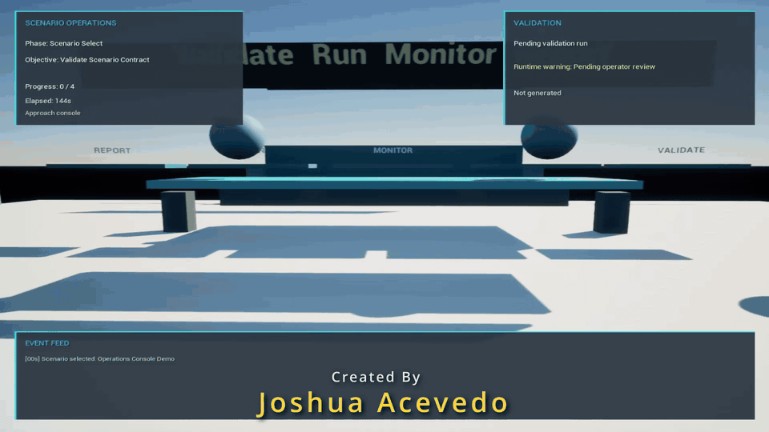

# Scenario Operations Console

Scenario Operations Console is a UE 5.8 C++ gameplay systems demo focused on reusable plugin integration, runtime scenario validation, operator-facing HUD feedback, and structured event reporting. The demo presents a compact console environment where the player validates a scenario, runs a short simulation sequence, acknowledges a runtime warning, and generates a completion report.

- **Status:** Playable operations-console demo complete
- **Engine:** Unreal Engine 5.8
- **Language:** C++
- **Focus:** Reusable Unreal plugins, mission / quest runtime systems, validation UI, event feeds, packaged demo workflow

## Demo

[](Media/GitHub/ScenarioOperationsConsoleDemo.mp4)

[Download the Windows demo build](https://github.com/Zoruahful/ScenarioOperationsConsole/releases/tag/v1.0.0-demo)

| CONSOLE | VALIDATION | REPORT |
| --- | --- | --- |
|  |  |  |

## Demo Flow

Open the project, press Play, and complete the console sequence:

1. Approach the operations console.
2. Press `E` to validate the scenario contract.
3. Press `E` to run the simulation.
4. Press `E` to monitor the objective route.
5. Press `E` to acknowledge the runtime warning.
6. Press `E` to generate the completion report.
7. Press `R` to reset and replay the sequence.

The HUD shows the current phase, objective, validation status, warning state, event feed, and report status.

## Engineering Highlights

- **Reusable plugin integration:** The host project imports and consumes `MissionScenarioRuntime` instead of keeping mission logic only in the game module.
- **Structured scenario contract:** The demo scenario is represented as JSON and parsed into C++ runtime state.
- **Operator interaction loop:** Player proximity and `E` input drive validation, simulation, monitoring, warning acknowledgement, and report generation.
- **Runtime HUD feedback:** `ASOCOperationsHUD` presents scenario progress, validation status, warnings, and event history during normal Play.
- **Code-built demo scene:** `ASOCOperationsDemoActor` constructs the playable console area in C++ for clear review and repeatable setup.
- **Packaged-demo workflow:** The project has been validated through a Windows package build for tester-friendly review.

## Project Structure

| Path | Purpose |
| --- | --- |
| `ScenarioOperationsConsole.uproject` | UE 5.8 host project. |
| `Content/Maps/OperationsConsole.umap` | Playable operations-console demo map. |
| `Source/ScenarioOperationsConsole` | Host project gameplay, pawn, HUD, controller, and demo scene code. |
| `Plugins/MissionScenarioRuntime/Source/MissionScenarioRuntime` | Reusable runtime mission system plugin. |
| `Config/DefaultEngine.ini` | Startup/default map configuration. |
| `Config/DefaultInput.ini` | Project input defaults. |
| `Media/GitHub` | README demo video, GIF preview, and screenshots. |

## Key Code

- `SOCOperationsDemoActor.cpp`: scenario contract, demo scene construction, operation steps, event feed, and report state.
- `SOCOperationsPlayerController.cpp`: console proximity checks and `E` / `R` interaction routing.
- `SOCOperatorPawn.cpp`: capsule-style player movement and camera behavior.
- `SOCOperationsHUD.cpp`: screen-space operations, validation, and event-feed panels.
- `MissionScenarioRuntimeLibrary.cpp`: JSON parsing and validation entry points.
- `MissionScenarioInstance.cpp`: reusable mission lifecycle and event log runtime.

## How to Run

Requirements:

- Unreal Engine 5.8
- Visual Studio 2022 with C++ game development tools
- Git LFS enabled before cloning

Clone:

```bash
git lfs install
git clone https://github.com/Zoruahful/ScenarioOperationsConsole.git
```

Open:

```text
ScenarioOperationsConsole.uproject
```

Build target:

```powershell
& 'Path\To\UE_5.8\Engine\Build\BatchFiles\Build.bat' ScenarioOperationsConsoleEditor Win64 Development 'Path\To\ScenarioOperationsConsole\ScenarioOperationsConsole.uproject' -WaitMutex -FromMsBuild
```

Then open `/Game/Maps/OperationsConsole` and press Play.

## Scope

This repository is intentionally small. It demonstrates a standalone project consuming a reusable scenario runtime plugin, not a full game. The current implementation focuses on durable C++ systems, readable operator feedback, and a short end-to-end demo path that can be inspected in code and played in editor.
