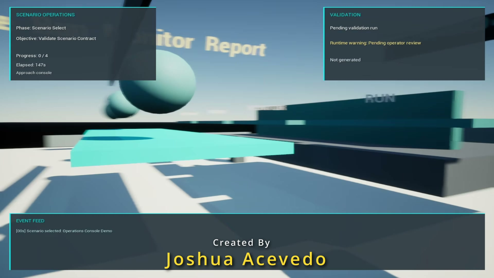
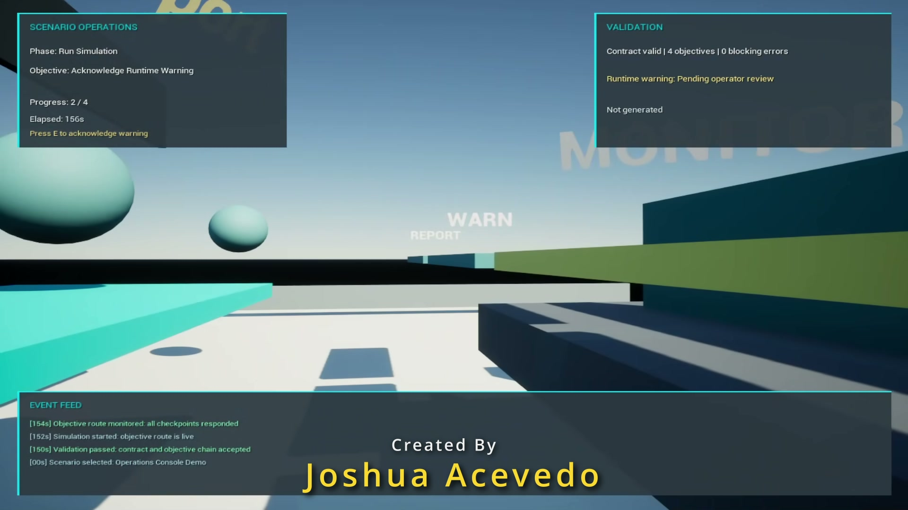
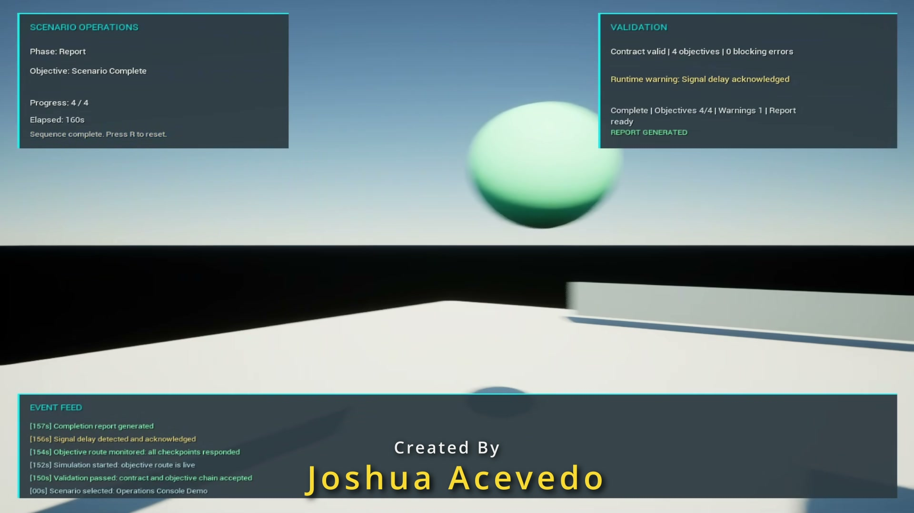

# Scenario Operations Console

Scenario Operations Console is a standalone Unreal Engine 5.8 project that consumes a reusable mission scenario runtime plugin. The demo presents a compact operator console where the player validates a scenario, runs a short simulation sequence, acknowledges a runtime warning, and generates a completion report.

## What This Demonstrates

- Reusing a C++ Unreal plugin from another host project
- Parsing and validating a structured scenario contract at runtime
- Driving an interactive objective sequence from mission state
- Presenting validation, progress, warnings, and completion data through an in-game HUD
- Packaging a small playable Windows demo from a source-controlled UE project

## Purpose

This project demonstrates reusable Unreal plugin integration, scenario validation, runtime event visibility, and tool-style UI design. The experience is intentionally generic so it can apply to simulation, training, gameplay, quest, or internal tools workflows.

## Demo Features

- Standalone Unreal Engine 5.8 C++ host project
- Imported reusable `MissionScenarioRuntime` plugin
- First-person capsule operator pawn
- Outdoor console test area with readable HUD and world labels
- Proximity-based console interaction
- Scenario validation, runtime event feed, warning acknowledgement, and report completion state
- Replay support with `R` reset

## Demo Media

[Watch the gameplay demo](Media/GitHub/ScenarioOperationsConsoleDemo.mp4)

## Demo Flow

1. Approach the console.
2. Press `E` to validate the scenario contract.
3. Press `E` to run the simulation.
4. Press `E` to monitor the objective route.
5. Press `E` to acknowledge the runtime warning.
6. Press `E` to generate the completion report.
7. Press `R` to reset and replay the sequence.

## Controls

- `WASD`: Move
- `Mouse`: Look
- `E`: Interact with the console
- `R`: Reset the demo sequence

## Project Structure

| Path | Purpose |
| --- | --- |
| `Source/ScenarioOperationsConsole` | Host project gameplay, pawn, HUD, and demo scene code. |
| `Plugins/MissionScenarioRuntime` | Reusable runtime plugin consumed by this project. |
| `Content/Maps/OperationsConsole.umap` | Playable demo level. |
| `Config` | Project maps, input, and gameplay defaults. |

## Requirements

- Unreal Engine 5.8
- Visual Studio 2022 with C++ game development tools

## Open In Unreal

Open `ScenarioOperationsConsole.uproject` with Unreal Engine 5.8.

The default map is `Content/Maps/OperationsConsole`.

## Build Notes

The repository is intended to store source project files only. Generated Unreal folders such as `Binaries`, `Intermediate`, `Saved`, `DerivedDataCache`, and packaged release output are excluded from source control.
